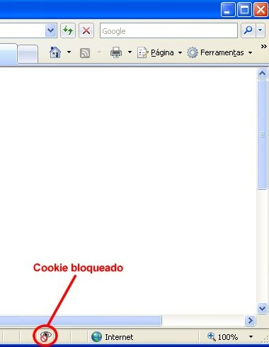

#Acompanhamento de iFrames com linker

##Passo 1 - Código de acompanhamento

O primeiro passo para o acompanhamento de iframes em domínios terceiros é alterar o código de acompanhamento do Google Analytics, essa configuração muda de acordo com a versão do GA.

Todas as chamadas da tag do GA devem contem o parâmetro `{'allowLinker': true}` junto da definição do domínio, que permite a continuidade da visita, também conhecida como cópia de cookies.

``` html
<script>
  (function(i,s,o,g,r,a,m){i['GoogleAnalyticsObject']=r;i[r]=i[r]||function(){
  (i[r].q=i[r].q||[]).push(arguments)},i[r].l=1*new Date();a=s.createElement(o),
  m=s.getElementsByTagName(o)[0];a.async=1;a.src=g;m.parentNode.insertBefore(a,m)
  })(window,document,'script','//www.google-analytics.com/analytics.js','ga');

  ga('create', 'UA-XXXX-X', 'domain.com', {'allowLinker': true}); //permitir a copia de cookies
  ga('send', 'pageview');

</script>
```

##Passo 2 - Criação do iframe

O `iframe` deve ser inserido dinâmicamente na página, para que isso seja feito da maneira correta, adicione um `div` com `ID` unico na página onde o `iframe` precisa ser criado.

**Nota:** recomendamos que todo estilo do `iframe` seja feito por um arquivo `CSS` externo. 

``` html
<div id="myiFrame"></div>
``` 

##Passo 3 - Script para cópia de cookies

Crie a função `addiFrame`, conforme o código abaixo, esta função recebe o `I	D` do `div` onde o iframe deve ser criado e url que se tornara o `src` do `iframe`.

``` html
<script type="text/javascript">
//definição da função addiFrame
var addiFrame = function(divId, url, opt_hash) {
	ga(function(tracker) {
		window.linker = window.linker || new window.gaplugins.Linker(tracker);
		var iFrame = document.createElement('iframe');
		iFrame.src = window.linker.decorate(url, opt_hash);
		document.getElementById(divId).appendChild(iFrame);
	});
};

//Adicionando o iframe na página
addiFrame('myiFrame', 'http://example.com');

</script>
```

##Exemplo Completo

``` html
<!DOCTYPE html>
<html lang="en">
<head>
	<meta charset="UTF-8">
	<title>Document</title>
</head>
<body>

<div id="myiFrame"></div>

<script>
	(function(i,s,o,g,r,a,m){i['GoogleAnalyticsObject']=r;i[r]=i[r]||function(){
	(i[r].q=i[r].q||[]).push(arguments)},i[r].l=1*new Date();a=s.createElement(o),
	m=s.getElementsByTagName(o)[0];a.async=1;a.src=g;m.parentNode.insertBefore(a,m)
	})(window,document,'script','//www.google-analytics.com/analytics.js','ga');

	ga('create', 'UA-XXXX-X', 'domain.com', {'allowLinker': true}); //permitir a copia de cookies
	ga('send', 'pageview');

	//definição da função addiFrame
	var addiFrame = function(divId, url, opt_hash) {
		ga(function(tracker) {
			window.linker = window.linker || new window.gaplugins.Linker(tracker);
			var iFrame = document.createElement('iframe');
			iFrame.src = window.linker.decorate(url, opt_hash);
			document.getElementById(divId).appendChild(iFrame);
		});
	};

	//Adicionando o iframe na página
	addiFrame('myiFrame', 'http://example.com');

</script>
</body>
</html>
```

#Cabeçalho P3P

P3P é a sigla para *Platform for Privacy Preferences*, um padrão desenvolvido para comunicar de forma rápida e automática a política de privacidade de um site ao usuário e permitir que ele a compare com suas preferências e acesso aos cookies.

Se esse cabeçalho não for presente na página o Internet Explorer pode bloquear a utilização de cookies, principalmente em iframes.

O usuário é informado do bloqueio com um ícone na barra de status do navegador conforme a imagem abaixo.



#Como definir o cabeçalho P3P

O cabeçalho P3P é uma definição feita do lado do servidor, abaixo exemplos de algumas formas para adicionar o P3P a sua aplicação, de acordo com a linguagem ou servidor.

###ASP

``` ASP

HttpContext.Current.Response.AddHeader("p3p", "CP=\""PSA CONo OUR ONL NOI BUS\""")
``` 

###PHP

``` PHP

header('P3P:CP="PSA CONo OUR ONL NOI BUS"');
``` 

###JSP

``` JSP

response.setHeader("P3P","CP='PSA CONo OUR ONL NOI BUS'")
``` 

###ColdFusion

``` ColdFusion

<cfheader name="P3P" value="CP='PSA CONo OUR ONL NOI BUS'" />
```

###nginx

Adicione a linha abaixo no arquivo nginx.conf

```
add_header P3P 'policyref="/w3c/p3p.xml", CP="PSA CONo OUR ONL NOI BUS", CP="CAO PSA OUR"'
```
